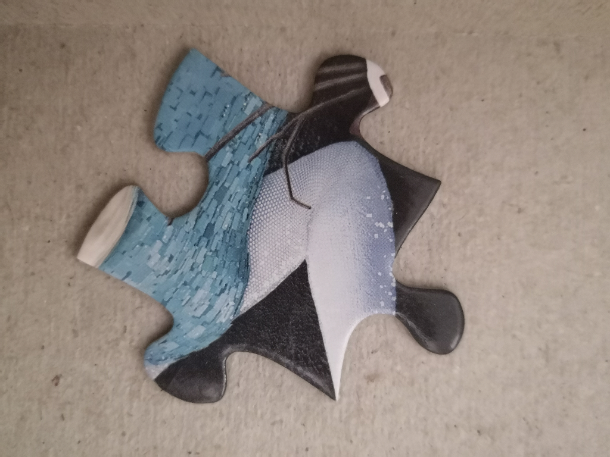
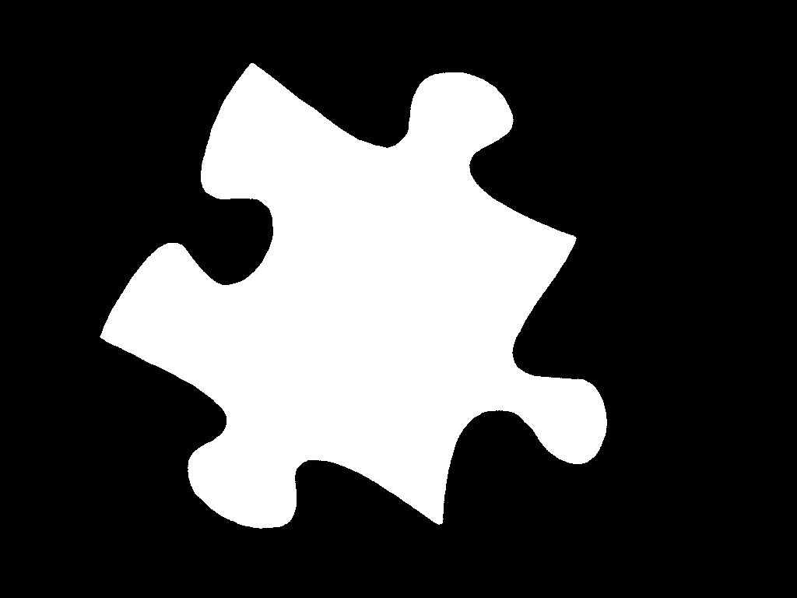
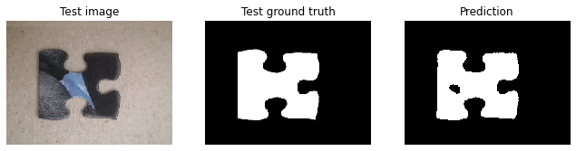
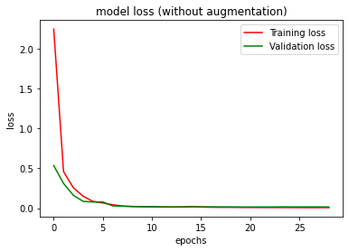
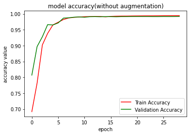
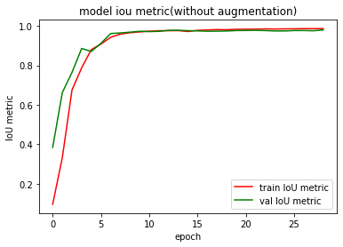
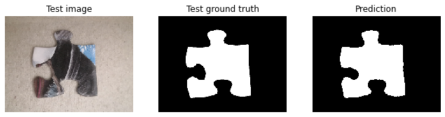
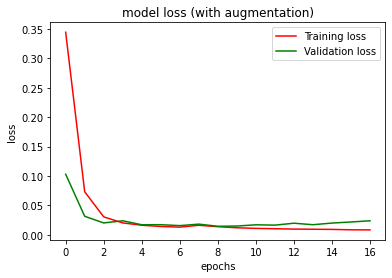
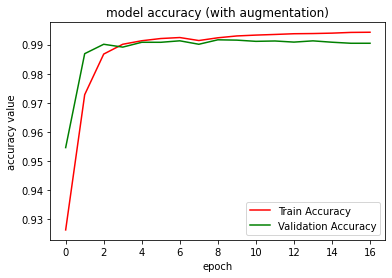
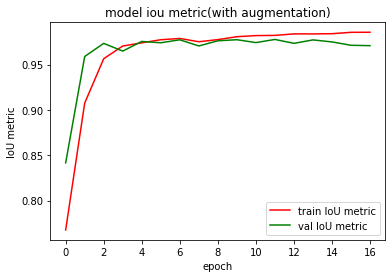

# Puzzle Pieces Segmentation using U-Net
This project was done in partial fulfillment of the requirement for the Computer Vision course lectured by Dr. Richard Klein from the Witwatersrand University.

## Project Overview
The aim of this project is to segment puzzle pieces from an image by training the U-Net model to predict a segmentation mask on the puzzle images. This is a computer vision technique called Semantic Segmentation which classifies each pixel in an image to a predefined class. For this project, we have two classes namely the puzzle and background.
The U-Net implementation was done in Python, Tensorflow and Keras. The aim set out above was achieved bythe following objectives:
* Implementation of the U-Net
* We trained the U-Net model with pre-trained weights from VGG16.
* Applied 6-fold cross validation

 For this work, we answered the following questions:
* Does data augmentation improve U-Net with a limited dataset?
* Does k-fold cross validation increase models accuracy?

## Sample Dataset
To train the model, we used the puzzle dataset from the computer vision course. The dataset consists of 48 pre-processed puzzle pieces with corresponding masks having dimensions 768 x 1024 x 3 and shape 768 x 1024 respectively.

 

  
  
  

The puzzle images are divided into training 70%, validation 15%, and test 15% images. This proportion yields 34 training images, 7 validation, and 7 test images. We applied horizontal and vertcal flip data augmentation increasing our training puzzle imagesfrom 34 to 136 images.

## U-Net Architecture
A U-Net is a deep learning technique for semantic segmentation task proposed by 2, which has demonstrated great impact in the area of biomedical images. U-Net model extends the Fully Convolutional Network (FCN) by 1, which learns to segment objects in an image in an end-to-end setting. It takes in an image of any size as an input and produces segmentation map with efficient inference and learning. The network architecture consists of the encoder path and the decoder path.

  

The encoder path has a sequence of 3 x 3 unpadded convolutional layers with ReLU activation followed by a max-pooling (2 x 2 kernel with 2 strides) for downsampling input images. The network applies max pooling on each channel of the input activation map separately in order to produce an output activation map. In the decoder layer, the feature maps from the encoder layer are expanded using 2 x 2 transposed convolutions. The feature maps are then concatenated to upsampled decoder feature maps to generate a re-scaled high resolution segmentation map and a class for each pixel 2. A schematic representation of the network architecture is shown above.

The implementation of the U-Net deep learning model in this project follows the implementation of the original paper by 2, with just a few small edits to suit our dataset better. The model was trained on a GTX 1060 machine with 6 GPU memory, Tensorflow, Python3, and Keras2. The model was trained with the following hyperparameters:
* Learning rate: 0.001
* Batch size: 6
* Drop-out rate: 10%
* Optimizer: Adam
* Loss function: binary cross-entropy
* Number of iterations: 34 Epochs

## Results
To evaluate the model we calculated the IoU for each image in the testing dataset and then averaged it to get the IoU metric value. The IoU measures the number  of pixels common across the target masks and prediction masks divided by the total number of pixels present in all masks.

### Without Data Augmentation
Qualitative results:

  

 

  
  
  
  

 
 ### With Data Augmentation
Qualitative results:

  

 

  
  
  
  

## Sources
1. [Long,  Jonathan,  Shelhamer,  Evan,  and  Darrell,  Trevor.Fully  convolutional networks for semantic segmentation.InCVPR 2015, 2015.]
(http://openaccess.thecvf.com/content_cvpr_2015/html/Long_Fully_Convolutional_Networks_2015_CVPR_paper.html)
2. [Ronneberger, Olaf, Fischer, Philipp, and Brox, Thomas.U-net: Convo-lutional networks for biomedical imagesegmentation. InMICCAI, 2015]
(https://link.springer.com/chapter/10.1007/978-3-319-24574-4_28)
